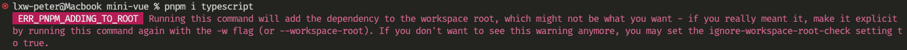
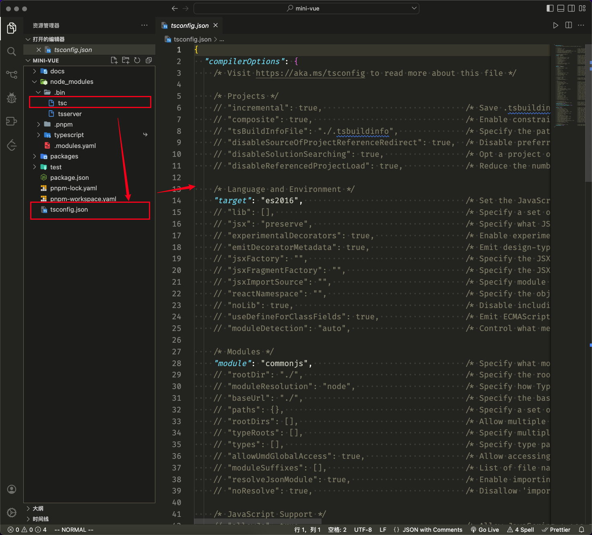

# 项目初始化

## init

```sh
mkdir mini-vue
cd mini-vue
pnpm init
```

## 创建 workspace

根目录下创建 `packages` 文件夹 `pnpm-workspace.yaml` 文件

```yaml
packages:
  # all packages in direct subdirs of packages/
  - 'packages/*'
```

## 添加全局 `typescript` 依赖

如果直接在根目录下安装ts，会提示如下错误



按照提示使用如下命令安装全局ts

```sh
pnpm i typescript -w
```

使用 `tsc` 生成 `tsconfig`

```sh
npx tsx --init
```



## 添加 `rollup` 及相关依赖

```sh
pnpm i rollup rollup-plugin-typescript2 @rollup/plugin-node-resolve @rollup/plugin-json @rollup/plugin-commonjs execa -D -w
```

### 依赖作用

- rollup: 模块打包工具
- rollup-plugin-typescript2: Rollup plugin for typescript with compiler errors
- @rollup/plugin-node-resolve: locates modules using the Node resolution algorithm, for using third party modules in node_modules
- @rollup/plugin-json: converts .json files to ES6 modules.
- @rollup/plugin-commonjs: convert CommonJS modules to ES6, so they can be included in a Rollup bundle
- execa: 开启多线程用来支持同时打包

## 配置`packages/*` 的 `package.json`

```json
{
  "name": "@vue/*",
  "version": "1.0.0",
  "description": "",
  "main": "index.js",
  "buildOptions": {  // 自定义打包选项
    "name": "Vue*",
    "formats": [
      "esm-bundler",
      "esm-browser",
      "cjs",
      "global" // 全局变量
    ]
  }
  // ...
}
```

## 给 `package.json` 添加打包命令

先创建 `script/build.js` 文件，然后在`package.json`中新增`build`命令

```json
{
  //...
 "scripts": {
    "build": "node scripts/build.js"
  }
  // ...
}
```
